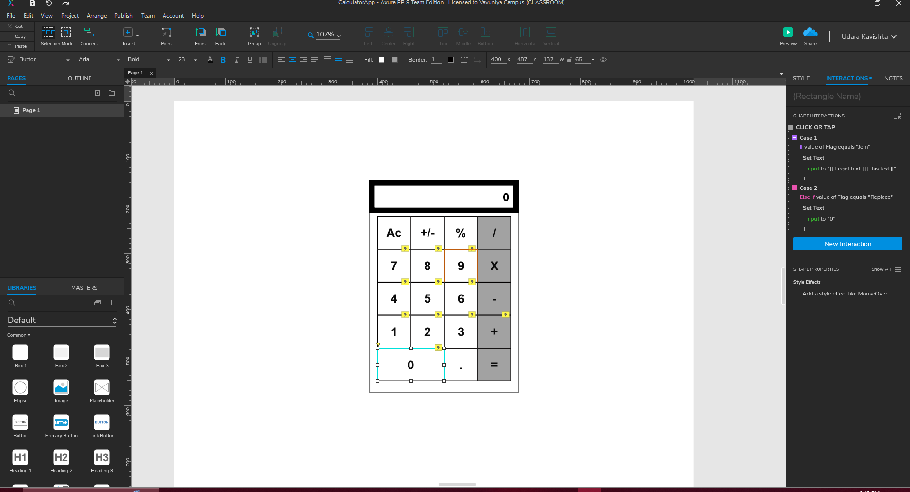

# Calculator App Project - Step-by-Step Development 🧮

This repository contains the step-by-step development of a **Calculator App** using **Axure RP 9**. Each week, new features and interactions will be added until the app is fully functional. Below is the progress and details of the current session (**Day 02**).

---

## Project Overview 🚀
The goal of this project is to build a fully functional calculator app with a user-friendly interface and interactive features. The development will be done in **Axure RP 9**, and this repository will be updated weekly to reflect the latest progress.

---

## Day 02 Progress - Basic Interface and Number Pad Interactions 🖥️

### Features Added in Day 02:
1. **Basic Calculator Interface**:
   - A simple calculator layout with a screen and a number pad (0-9).
   - Buttons for numbers (0-9) and basic operations (to be added in future sessions).

2. **Interactions for Number Pad (0-9)**:
   - Interactions are added to update the calculator screen when a number is clicked.
   - Two variables are created:
     - **Flag**: Used to determine whether to replace or join the input.
     - **Saved Number**: Used to store the current input value.

3. **Initial Variable Setup**:
   - When the page is loaded:
     - Set **Flag** to `"Replace"`.
     - Set **Saved Number** to `""` (empty string).

4. **Interaction Logic for Numbers (1-9)**:
   - **Case 01**: If the value of **Flag** equals `"Replace"`:
     - Set the calculator screen text to `[[This.text]]` (the clicked number).
     - Set **Flag** to `"Join"`.
   - **Case 02**: If the value of **Flag** equals `"Join"`:
     - Set the calculator screen text to `[[Target.text]][[This.text]]` (append the clicked number to the existing text).

5. **Interaction Logic for Number 0**:
   - **Case 01**: If the value of **Flag** equals `"Replace"`:
     - Set the calculator screen text to `"0"`.
   - **Case 02**: If the value of **Flag** equals `"Join"`:
     - Set the calculator screen text to `[[Target.text]][[This.text]]` (append `0` to the existing text).

---

## Screenshots 📸
Below are the screenshots of the current progress:

### Calculator Interface:
<!-- Add screenshot of the calculator interface here -->

---

## How to Use the Axure RP 9 File 📂
1. Download and install **Axure RP 9** if you haven't already.
2. Open the `.rp` file provided in this repository.
3. Navigate through the pages using the **Page Navigator** in Axure RP 9.
4. Preview the prototype by clicking the **Preview** button to see the interactions in action.

---

## Weekly Updates 🔄
This repository will be updated weekly with new features and interactions. Below is the planned roadmap:

### Week 1 (Day 02):
- Basic calculator interface.
- Interactions for number pad (0-9).

### Week 2:
  

### Week 3:

### Week 4:

---

## Hosted Project on Axure Cloud ☁️
The project will be hosted on **Axure Cloud** for easy access and interaction. You can view the live prototype by clicking the link below:

🔗 **[Axure Cloud Project Link](https://tt1cdy.axshare.com)**  

---

## License 📜
This project is licensed under the MIT License. See the [LICENSE](LICENSE) file for details.